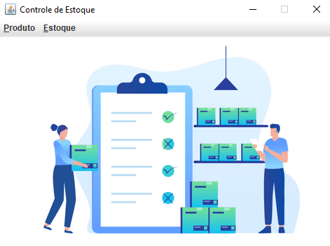
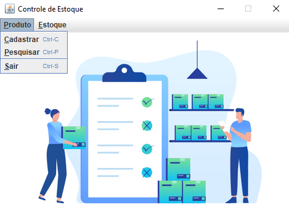
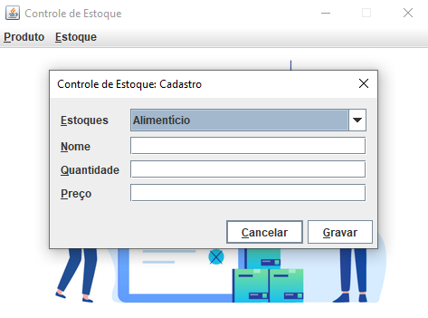
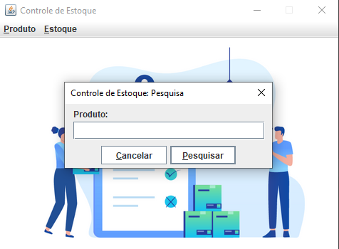
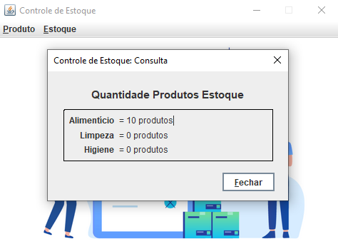
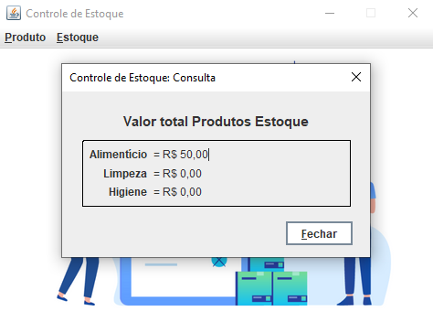
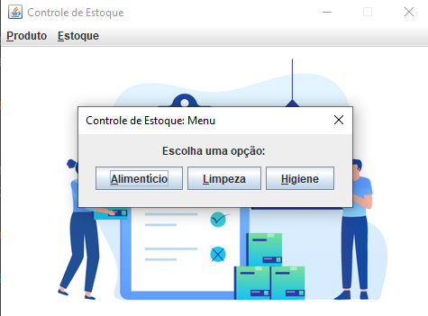
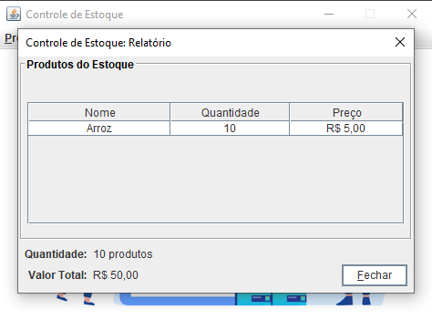

# Inventory Control (Controle de estoque)

Este é um projeto de controle de estoque que utiliza Java para gerenciar diferentes categorias de produtos em um armazém. 
O sistema possui uma interface gráfica para facilitar o cadastro, consulta e relatórios de produtos em estoque.

## Estrutura do Projeto

O projeto está organizado em pacotes para separar as funcionalidades de utilitários, controle, modelos e a interface gráfica.

- `util`: Contém constantes, enums e métodos auxiliares para conversão de valores e exibição de mensagens.
- `baseclasses`: Contém a classe `Warehouse` que representa o modelo de um armazém, que guarda objetos da classe `Product`. Está classe implementa a interface `Stock`
- `baseclasses.control`: Contém a classe principal `StockControl` que inicializa e controla os estoques.
- `baseclasses.control.gui`: Contém as classes de implementação das interfaces graficas GUI usadas.

  ## Interfaces GUI

  O programa utiliza uma variedade de interfaces gráficas para permitir aos usuários interagir com o controle de estoque de forma intuitiva.
  Abaixo estão as principais interfaces gráficas e suas funcionalidades:

  ### IgStockControl

  Principal do sistema, responsável por permitir ao usuário navegar entre as diferentes operações de cadastro, consulta e relatórios. 

  
  
  

  ### IgRegister

  Utilizada para cadastrar novos produtos no estoque.

  

  ### IgSearch

  Permite ao usuário pesquisar produtos no estoque.

  

  ### IgQuery

  Usada para consultar informações sobre os produtos do estoque.
  
  

    - Consultar sobre a quantidade de produtos em cada estoque

  
  
    - Consultar o valor total de produtos em cada estoque

  ### IgMenu

  Apresenta as opções de estoques disponives para exibir o relatório.
  
  

  ### IgReport

  Exibe o relatório do estoque escolhido pelo usuário.
  
  
  
  
## Bibliotecas Externas

- `miglayout15-swing`: Biblioteca de layout utilizada para criar as interfaces gráficas.

  
## Como Rodar o Projeto

Para rodar o projeto, siga estas etapas:

1. Certifique-se de ter o Java Development Kit (JDK) instalado em seu sistema.
2. Clone o repositório do projeto em sua máquina local.
3. Abra o projeto em sua IDE preferida (como o Eclipse).
4. Adicione o arquivo JAR da biblioteca `miglayout15-swing` ao classpath do projeto.
5. Compile o projeto para garantir que não haja erros de compilação.
6. Execute a classe `StockControl.java` para iniciar o programa.
7. A interface gráfica principal será exibida, permitindo que você interaja com o controle de estoque.

  
